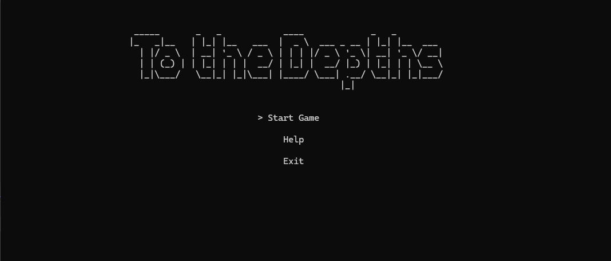
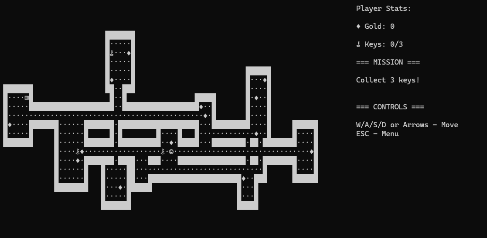
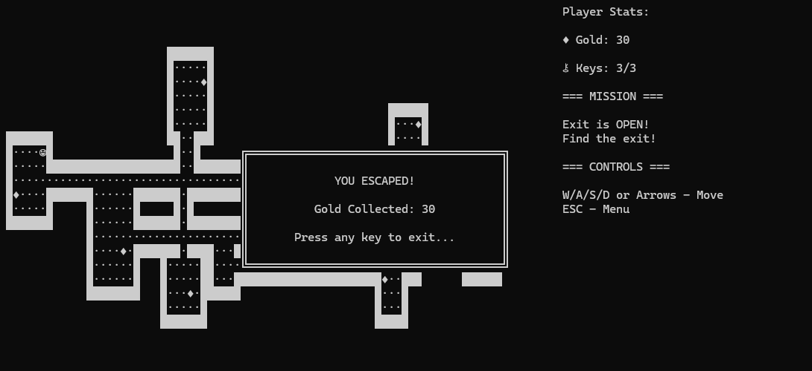

# 🏚️ To the Depths

A console-based dungeon crawler written in C# (.NET 10). Explore procedurally generated dungeons, collect keys and gold, and find your way out.

---

## 🎮 Gameplay

You wake up deep underground. The exit is sealed — you'll need to collect **3 keys** scattered across the dungeon before you can escape. Grab gold along the way and get out alive.

### Win Condition
Collect all **3 keys**, then step onto the **Exit tile (`▥`)**.

---

## 🗺️ Legend

| Symbol | Meaning      |
|--------|--------------|
| `☺`    | Player (you) |
| `⚷`    | Key          |
| `♦`    | Gold         |
| `▥`    | Exit         |
| `█`    | Wall         |
| `·`    | Floor        |

---

## 🕹️ Controls

| Key              | Action          |
|------------------|-----------------|
| `W` / `↑`        | Move Up         |
| `S` / `↓`        | Move Down       |
| `A` / `←`        | Move Left       |
| `D` / `→`        | Move Right      |
| `ESC`            | Return to Menu  |
| `Enter`          | Confirm (menu)  |

---

## ⚙️ Level Generation

Each dungeon is generated fresh every run:

1. Up to **10 rooms** are placed randomly (no overlaps)
2. Rooms are connected with **L-shaped corridors**
3. **Walls** are added around all floor tiles
4. **Gold** is scattered by chance (~10% per floor tile)
5. **3 Keys** and **1 Exit** are placed in random rooms
6. The player starts at the center of the first room

---

## 🚀 Getting Started

### ⬇️ Just play
Download `ToTheDepths.exe` from the [Releases](https://github.com/casidor/To-The-Depths/releases/latest) page and run it. No installation needed.

> Windows only.

### 🔧 Build from source
```bash
git clone https://github.com/casidor/To-The-Depths.git
cd To-The-Depths
dotnet run --project ConsoleUI
```

---

## 🔧 Configuration

All game parameters live in `Core/Config.cs`:

| Constant       | Default | Description                        |
|----------------|---------|------------------------------------|
| `ConsoleWidth` | 110     | Console window width               |
| `ConsoleHeight`| 30      | Console window height              |
| `FieldWidth`   | 80      | Dungeon grid width                 |
| `FieldHeight`  | 25      | Dungeon grid height                |
| `MaxRooms`     | 10      | Maximum number of rooms            |
| `KeysAmount`   | 3       | Keys required to open the exit     |
| `GoldAmount`   | 10      | Gold value per pickup              |
| `GoldChance`   | 10      | % chance of gold on each floor tile|
| `MinRoomSize`  | 3       | Minimum room dimension             |
| `MaxRoomSize`  | 8       | Maximum room dimension             |

---

## 📸 Screenshots

### Main Menu


### Gameplay & Sidebar


### Escape


---

## 📄 License

MIT — do whatever you want with it.
